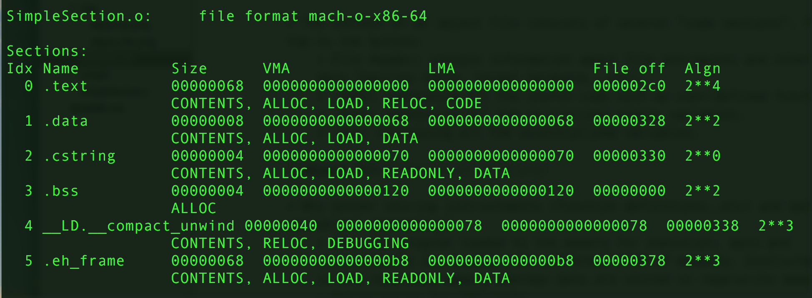
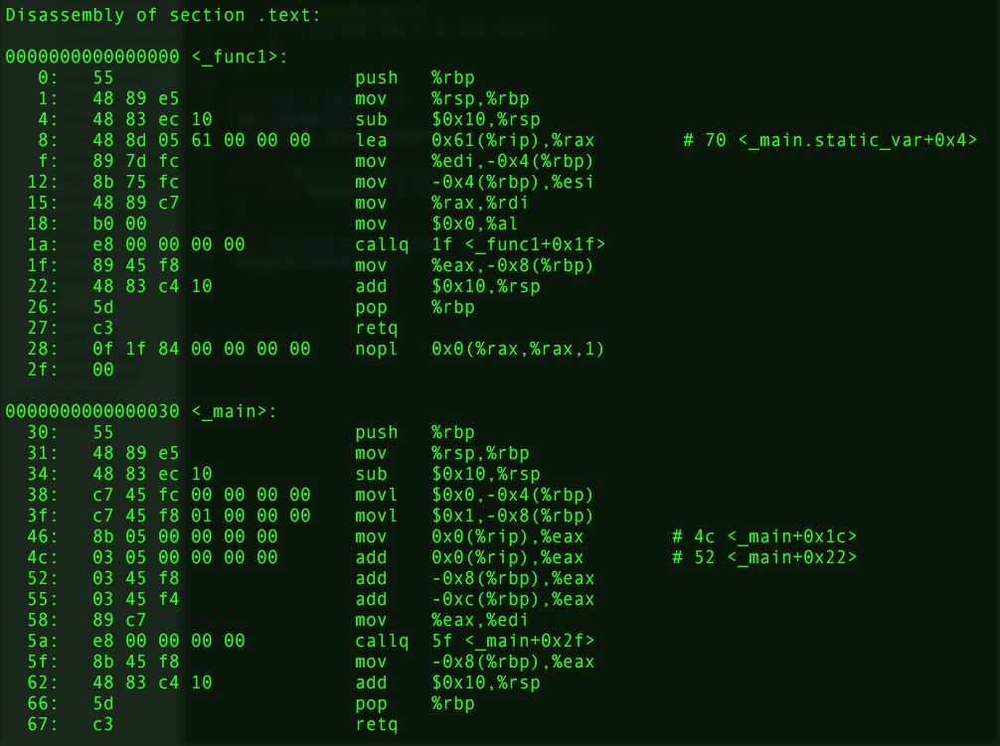

# Object File

## Intro

- In order to follow this note, you need to install `coreutils` for utility functions such as `objdump`.
- On `OS X`, you can use `brew` to install `coreutils`. All the utility functions will be prefixed with a `g`. ex: `objdump` --> `gobjdump`.

## Content of an Object File

- The content of an object file consists of several "code sections". From the top to the button:
    + File Header: contain information about file attributes and other meta data (Section table, target hardware...etc).
    + .text: containing all the source code such as user-defined functions.
    + .data: containing all the initialized static variables.
    + .bss: containing all the uninitialized variables.

- Why bother storing instructments (function definitions..etc) and data (variables) seperately?
    + When the program loaded to the memery for execution, data and instructments are loaded into different kind of memeory. Instructments are in the read-only memory whereas data are stored in read-write memory.
    + Optimization for CPU cache.
    + When the program is used by different processes, all the read-only data (the instruments, specifically) could be shared by these processes. However, the readable and writable data should be private to each process. 

## SimpleSection.c

- `gcc -c SimpleSection.c`: generate object file
- `gobjdump -h SimpleSection.o`:
    + `-h`:  Display the contents of the section headers
    + `-t`, `--syms`: Display the contents of the symbol table(s)
    + `-T`, `--dynamic-syms`: Display the contents of the dynamic symbol table

- `Size`: size of the section (in bytes)
- `File off`: file offset. The offset of the section in memory.

In this example, you can see that:

- The file offset of `.text` is `000002c0`, which means the header size is `704` bytes (from `0x00000000` to `0x000002bf`).
- The size of `.text` is `00000068` (`104` bytes).
- Since the size of `.text` is `00000068` and the file offset of it is `0x000002bf`, the file offset of `.data` will be `0x000002c0`+`00000068`=`0x00000328`.

-----

- `gobjdump -s -d SimpleSection.o`
    + `-s`: Display the full contents of all sections requested
    + `-d`, `--disassamble`: Display assembler contents of executable sections.
    + `-D`, `--disassemble-all`:Display assembler contents of all sections

**Note**: you can use `__attribute__((section("name")))` to write data to user-defined section in the object file.

