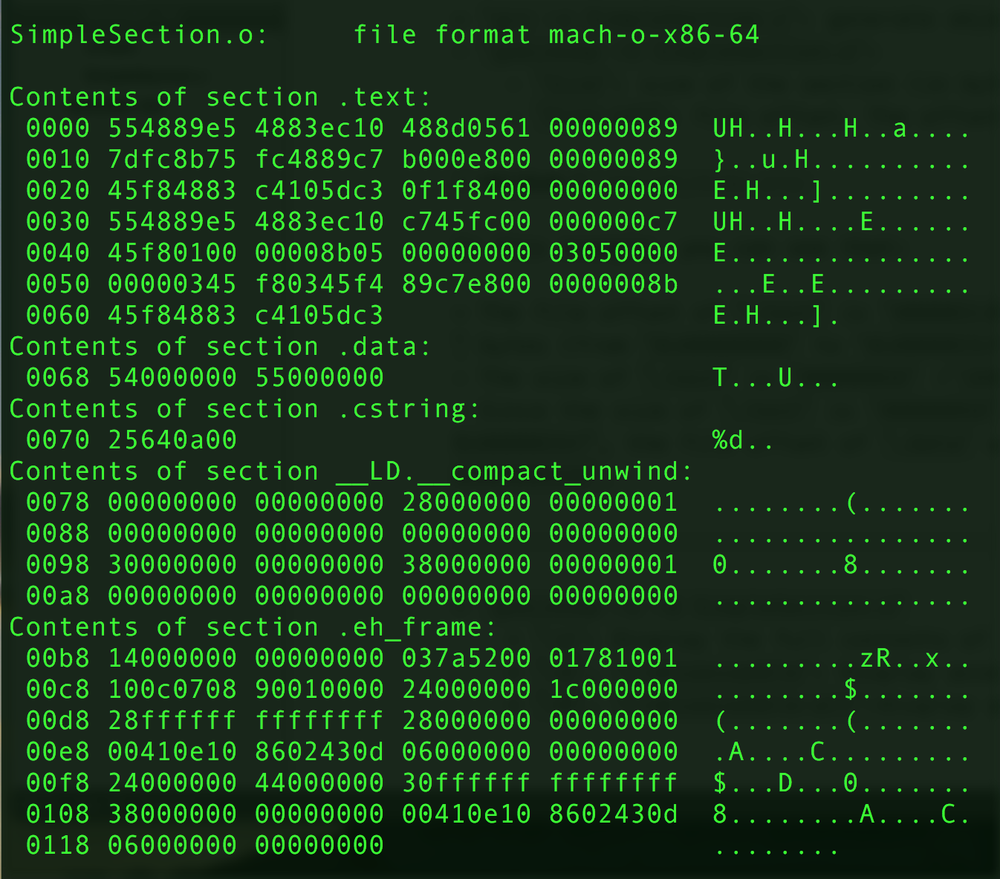

# Object File

## Intro

- In order to follow this note, you need to install `coreutils` for utility functions such as `objdump`.
- On `OS X`, you can use `brew` to install `coreutils`. All the utility functions will be prefixed with a `g`. ex: `objdump` --> `gobjdump`.

## Content of an Object File

- The content of an object file consists of several "code sections". From the top to the button:
    + File Header: contain information about file attributes and other meta data (Section table, target hardware...etc).
    + .text: containing all the source code such as user-defined functions.
    + .data: containing all the initialized static variables.
    + .bss: containing all the uninitialized variables.


- Why bother storing instructments (function definitions..etc) and data (variables) seperately?
    + When the program loaded to the memery for execution, data and instructments are loaded into different kind of memeory. Instructments are in the read-only memory whereas data are stored in read-write memory.
    + Optimization for CPU cache.
    + When the program is used by different processes, all the read-only data (the instruments, specifically) could be shared by these processes. However, the readable and writable data should be private to each process. 

## SimpleSection.c

- `gcc -c SimpleSection.c`: generate object file
- `gobjdump -h SimpleSection.o`:
    + `-h`:  Display the contents of the section headers
    + `-t`, `--syms`: Display the contents of the symbol table(s)
    + `-T`, `--dynamic-syms`: Display the contents of the dynamic symbol table


- `Size`: size of the section (in bytes)
- `File off`: file offset. The offset of the section in memory.

In this example, you can see that:

- The file offset of `.text` is `000002c0`, which means the header size is `704` bytes (from `0x00000000` to `0x000002bf`).
- The size of `.text` is `00000068` (`104` bytes).
- Since the size of `.text` is `00000068` and the file offset of it is `0x000002bf`, the file offset of `.data` will be `0x000002c0`+`00000068`=`0x00000328`.

-----

- `gobjdump -s -d SimpleSection.o`
    + `-s`: Display the full contents of all sections requested
    + `-d`, `--disassamble`: Display assembler contents of executable sections.
    + `-D`, `--disassemble-all`:Display assembler contents of all sections




**Note**: you can use `__attribute__((section("name")))` to write data to user-defined section in the object file.

## Weak and Strong Symbol

Once we have all these object files, we get to the final step of compilation, linking (we will see more detailed discussion in later chapters). In the linking phase, linker will use the reference information in the object files (Symbol Table) to link every object files together. However, it is commonly seen that we may define duplicate variable in different object files. What would linker deal with these duplicate variables? This leads to the idea of *weak** and **strong** symbols.

Basically, whether a symbol would be strong or week depends on the language implementation (C/C++ by default will make functions and initialized global variables strong symbols, uninitialized global variable weak symbols). 

For `gcc`, we can use `__attribute__((weak))` to make one symbol a weak symbol.
Here is the sample code:

```{c}
extern int ext;

int weak;
int strong = 1;
__attribute__((weak)) weak2 = 2;

int main(){
    return 0;
}
```

- `ext`: A external variable. It is not strong nor weak symbol. the `extern` keyword just states that its reference is to other exteranl object files.
- `weak`, `weak2`: these are weak symbols. `weak` is global *uninitialized* variable. `weak2` is weak since force assignment by `__attribute__((weak))`.
- `strong`, `main`: strong symbols.

The rules linker use to deal with strong and weak symbols:

1. Mutiple declaration for single strong symbol is not allowed.
2. If one symbol is declared as strong symbol in one object file but weak in the other object files, the strong one is choosen.
3. If one symbol is declared as weak in all object files, then the one which occupies the largest memory size will be choosen.

One use case for `__attribute__((weak))` is that you can design different version of code depending on the libraries available. For example, you can build multi-threaded executable when `pthread` library is available but single-threaded when it is not available. See `Thread.c` for detail.
